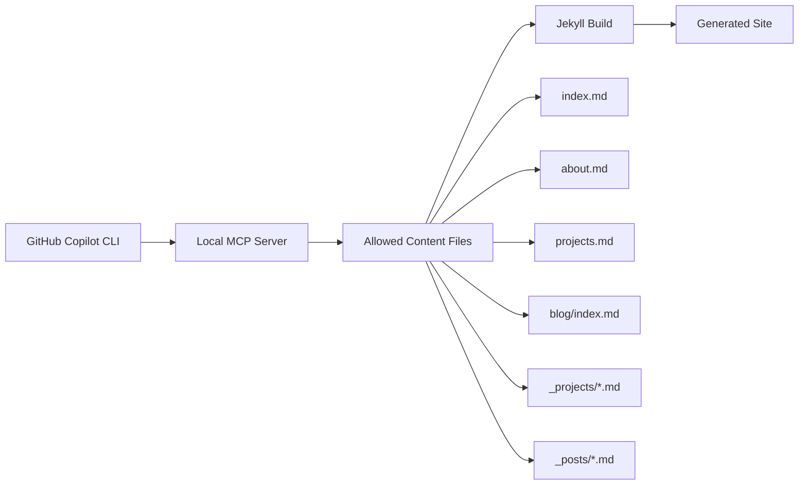

# Architecture

This project is a static Jekyll portfolio focused on Markdown-authored content, lightweight layouts, and GitHub Pages deployment.

## System Overview

## Main Components

- `index.md`, `about.md`, `projects.md`, and `blog/index.md` hold the main page content.
- `_projects/` stores project case studies rendered through `project` layout.
- `_posts/` stores blog entries rendered through `post` layout.
- `_layouts/default.html` provides the shared page shell.
- `assets/css/main.css` and `assets/js/main.js` provide styling and light interaction.
- `mcp/portfolio_site_mcp_server.py` exposes safe content-focused tools for GitHub Copilot CLI.

## Content Flow

1. Copilot CLI receives a natural-language content request.
2. The `portfolioSite` MCP server narrows editing to approved content paths.
3. Copilot reads current content through `get_content_file`.
4. Copilot writes updated Markdown and frontmatter through `write_content_file`.
5. Jekyll rebuilds the site through `build_site` when Bundler is available.

## Safety Boundaries

- The MCP server only allows content file targets.
- Layouts, CSS, JavaScript, and arbitrary files are intentionally blocked from MCP writes.
- Existing user-level Copilot MCP settings remain in `~/.copilot/mcp-config.json`; the installer merges the new server entry instead of replacing the file.

## Related Files

- `docs/workflows.md`
- `docs/conventions.md`
- `docs/integrations.md`
- `mcp/portfolio_site_mcp_server.py`
